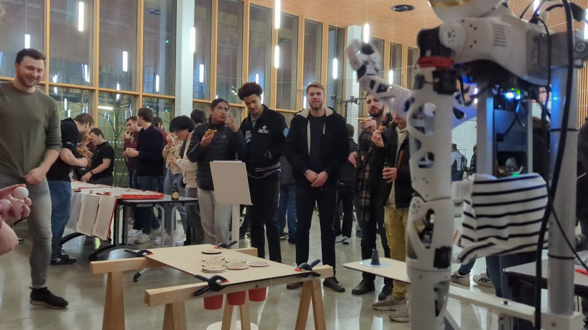

# Dynamic Reachy

**Description:** Using teleoperation with VR headset and dynamic control to plan precise movements, 
in the context of a ball launch with the **Reachy** robot from __[Pollen Robotics](https://www.pollen-robotics.com/)__.

 

[📖 User documentation](docs/user) • [👨‍💻 Developer documentation](docs/developer) • [📈 Project report](docs/report) • [📚 Bibliography](docs/bibliography) • [⚠️ Risk Analysis](docs/risk)
  
## 📄 This project in short
With the final demonstration idea of a robot unbeatable at beer pong, this project aim to meliorate the dynamic 
behaviour of the robot Reachy.

We also worked on the treatment and characterization of trajectories, with the initial aim of making Reachy able to learn 
and generate his own trajectories, thanks to a database made with VR teleoperation.

The search of precision in the reproduction of a movement led us to study the PID parameters of the robot, and 
constraints such as the torque from gravity applied on the joints.

In parallel, the need of reproducibility for the repetition of one trajectory brought us to search about the causes of 
these different behaviours with the same order.

## 🚀 Quickstart

* **Install instructions**: Everything is already installed on the Intel NUC of Reachy
* **Launch instructions**: To launch correctly the robot, you must do those few steps :
  * Turn on the motors switch on the back (see our repairs on the robot to find them)
  * Turn on Reachy's Intel NUC with the button on the back
  * On 2 different shells of the NUC, launch the following commands :
    * `cd ~/dynamic_reachy/src`
    * `launch_all`
    and
    * `cd ~/dynamic_reachy/src`
    * `python3 api.py`
  * Click on the provided link and play by choosing a target cup !

## 🔍 About this project

|       |        |
|:----------------------------:|:-----------------------------------------------------------------------:|
| 💼 **Client**                |  Pollen Robotics                                            |
| 🔒 **Confidentiality**       | **Public** or **Private** *(1)*                                         |
| ⚖️ **License**               |  [Choose a license](https://choosealicense.com/) *(1)*                  |
| 👨‍👨‍👦 **Authors**               |  [FORNES Guillaume](https://github.com/GuiFornes/), [DIEUDONNE Clara](https://github.com/D-Clara/), [DEPLANNE Coralie](https://github.com/Drenayaz/) 

*(1) Refer to your client to make a choice. Then update the repository accordingly: the visibility in the settings and replace the [LICENSE](./LICENSE) file.*
