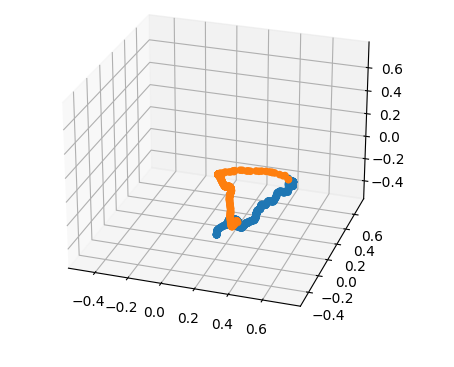

# Global Utilisation

## Reachy SDK server service

Before running any functions or teleoperation you first have to launch the reachy sdk.
If you start the motors before starting Reachy, the SDK will start automatically. If you turn off the motor with Reachy on you will a to restart the SDK after having re turn on the motors.

- To turn on the SDK server :
```
sudo systemctl start reachy_sdk_server.service
```

- To turn off the SDK server :
```
sudo systemctl stop reachy_sdk_server.service
```
- To restart the SDK server :
```
sudo systemctl restart reachy_sdk_server.service
```

- To check the actual status of the SDK server :

```
sudo systemctl status reachy_sdk_server.service
```


Thank to the *reachy_tips* it is possible to launch all the services and show all the logs in real time. It is better to use the command :
```
launch_all
```

You then have to wait for "*READY TO DESTROY THE WORLD!*" to run the other functions.


## Use the teleoperation 

With a new VR headset you can look at the __[Pollen documention](https://docs.pollen-robotics.com/vr/introduction/introduction/)__.

With our VR headset you just have to :
- Sonnect it to the same WIFI network as Reachy
- Launch *TrachuYeleoperationApplication*
- set Reachy IP adress
<div class="warning">


**Warning**
Make sure to read the __[best practice](https://docs.pollen-robotics.com/vr/use-teleop/best-practice/)__ before starting


## Record a trajectory
There are two type of recording :
- recording during the teleoperation : the function record what you are actually doing
- recording without the teleoperation : you can manually move the robot and it will record the trajectory

To record a trajectory you have to run get_traj depuis le dossier *src* :
```
python3 get_traj
```

The record will be saved in the *traj* directory with the name :
*date time name*

Some parameters can be changed directly in the file :
- FILENAME_COMMENT : the name add to the filename
- RECORD_FREQUENCY : the frequency at which we get point

## Plot a trajectory
You can show what you trajectory looks like with the *plot_traj* function :

<div align="center"><figure>
   
  <figcaption>The trajectory of a ball throw</figcaption>
</figure></div>

The orange represente the movment when the gripper is closed and the blue when it's open.

To use it you have to change the FILEPATH in the *plot_traj.py* with an absolute path.
Then run it use :
```
python3 plot_traj
```

## Reproduce a trajectory

To reproduce a movment you can use the *src/reproduce_traj.py*.

Different parameters can be change in the file :
- FILENAME : the absolute path of the wanted trajectory (.npz)
- RECORD_FREQUENCY : the recording frequency (usally 100)
- PREPROCESSING : *True* or *False*, to activate or not the preprocessing that compensates for the force of gravity 
- TYPE_OF_POSITION : *GOAL_POSITION* or *CURRENT_POSITION*, to use the goal position or the current position

Here is an example : 

```
FILENAME = '/home/reachy/dynamic_reachy/traj/2023-01-30_17:41:16_test.npz'
RECORD_FREQUENCY = 100
PREPROCESSING = True
TYPE_OF_POSITION = GOAL_POSITION
```

two different functions in the file :
- *reproduce_traj* : to reproduce the trajectory with current position
- *reproduce_traj_bis* : to reproduce the trajectory with goal position


To run the file use this command (if you are in the *src* directory) :
```
python3 reproduce_traj.py
```

## Emergency stop

In case of ermergency you can stop the robot by __turning off all the motors__ or you can also __stop the sdk server__.

Normally, if you kill (by Ctrl+c) a running function that make the robot move, the robot will stop moving and become smoothly.
If there is a problem and the robot don't become smootly you can also use the file __*turn_off.py*__ in the *src/* directory.

```
python3 turn_off.py
```


:Warning: To use these functions you have to replace the reachy_sdk_server.py in the reachy_ws by the reachy_sdk_server.py in the dynamic_reachy/src/data folder.


[Back to summary](README.md)

