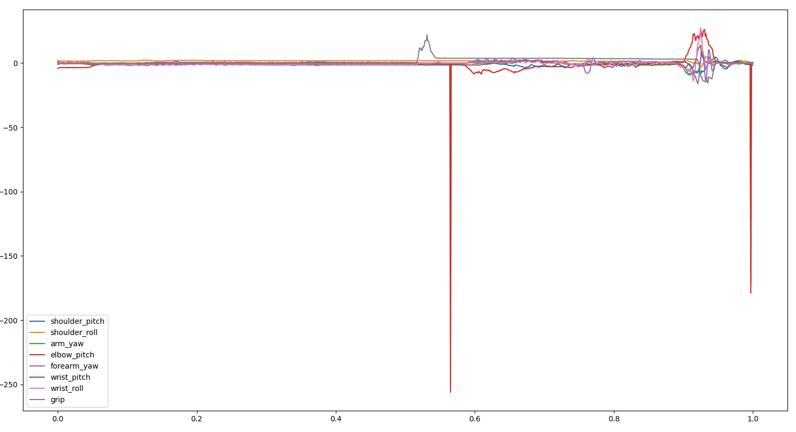
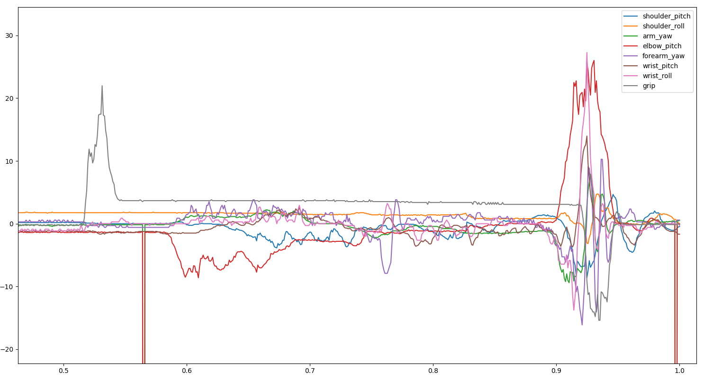

# PID improvement

## PID test for one motor

<span style="color: #7ECBB7">
First steps
</span>

To get started with PIDs, a methode to discovered the impact was done. It consiste to do small repetitive mouvement and see shaking and the average of errors to reach the extreme positions. This is done in pid_motor_test.py with *error*.

<span style="color: #7ECBB7">
Problem with the 2 wrist motors
</span>

While trying to do the test for the wrist, a problem occurred, no matter the pid values chosen, the 2 motors of the wrist shake quite strongly mainly bumps when the motors are in 0° position. 

https://user-images.githubusercontent.com/74452893/217235552-c3513cd5-967e-47f8-95c6-e3eb48d6a5f4.mp4

https://user-images.githubusercontent.com/74452893/217235544-f9e9d0ef-f5c1-4a00-95a0-34a616ffc570.mp4

So we wanted to check that the engine was working well. The same action was done with a dynamixel setup connect directly to the motor and no shaking was observed. 

https://user-images.githubusercontent.com/74452893/217235982-14a15ce0-40cf-47b5-9d28-995db0e69523.mp4

We came to the conclusion that it must be a problem of tension drop at the end of the arm preventing good control of the wrist.

<span style="color: #7ECBB7">
Ziegler and Nichols methode
</span>

After taking in hand the pids by the previous method we set up a more theoretical method. 

We try to use the Ziegler and Nichols methode but it was not sucessful.

<span style="color: #7ECBB7">
Study of step response 
</span>

A command in position is sent to the motor and we watch its step response with the function *error_pos* in pid_motor_test.py. The step response can be plot by launching the file PID_evaluation_plot.py in parallel to the movement. 
> **Note**
> Don't forget to modify the motor name for which the data are collected, in the fonction *get_current_position*.

The first step is to chose proportionnal gain. For this, the gain has been increased until the error in the final position is low while having a reasonable overshoot. 

A step response with a small proportionnal gain (10) with a 40° control:


A step response with a big proportionnal gain (200) with a 40° control:


After, integrale gain is choose to reduce the amplitude of the shakings and derival gain to reduce the duration of the shakings. All this modification allow to obtain this type of step response for a 40° control: 


So good pid gains for each MX motor are:

- r_shoulder_pitch : 64,10,100
- r_shoulder_roll : 64,10,100
- r_arm_yaw : 20,0,0
- r_elbow_pitch : 64,10,100
- r_forearm_yaw : 20,0,0
- r_wrist_pitch : 20,0,0

## PID test reproducing a trajectoire

After to do it one by one, the idea was to collect the error of each motor during a movement using function *error* in pid_traj_error_record.py and then display them. Error are not the same for several identical movements, so errors are store in files in directory tst/log_pid. The file show_traj_error.py allow to show errors from a file in tst/log_pid. 

This type of graph is obtained:



zooming in:



This methode alllow to see the impact of all the motor together on a typical throw.


## Setup PID

The pid of the right arm can by modify in the file change_PID.py using *change_PID* with a array of pid values for each arm motor in order. 

For instance ```change_PID([[64,10,100],[64,10,100],[20,0,0],[64,10,100],[20,0,0],[20,0,0],[20,0,0]]) ```

There is also the possibility to know the current arm right PID of reachy with *print_PID* in change_PID.py 

> **Warning**
> PIDs are store in RAM, so the setup need to be done each time the motors reset.

