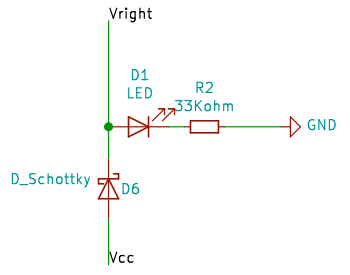

# Repair & Update of Reachy
## Right Arm

After a handling error in which Reachy tried to move its arm while being blocked, the arm was no longer detected.
We tried to find the problem based on the symptoms:
- The SDK does not start
- The led related to the right arm does not turn on (D1 on the diagram)
- There is no tension in the right arm
- The left arm and head work correctly

After comparing Reachy's information with the robot's electrical diagrams, we concluded that the problem came from the diode that connects the robot's power supply to the input tension in the left arm (D6 in the diagram).

<figure>
   
  <figcaption>Electric diagram before modifications</figcaption>
</figure>

As this diode was not easily accessible and we did not have a diode with same caracteristics (5A and 100V), we decided to add two diodes (diode 1N5822 : 3A and 40V) to accessible points on the board that correspond to the same ends of the diode D6.
This solution bypassed the on/off switch for the motors, which is useful during robot manipulation. We therefore decided to add a new switch before the diode to be able to turn off the right arm motors anyway.

<figure>
   
  <figcaption>Electric diagram after modifications</figcaption>
</figure>

<figure>
   
  <figcaption>Picture of the repair</figcaption>
</figure>

## Left Arm

We found several problems with Reachy's left arm.
First, there was a 45-degree error on a shoulder joint. A piece had been changed at that location the previous year, so we concluded that the motor had been mispositioned. So we simply disassembled the robot's arm, repositioned the motor, which solved this first problem.
After some manipulation of the left arm, we noticed some unpredictable and fairly violent parasitic movements. This problem was caused by a software problem that was fixed by updating the code.

<figure>
   
  <figcaption>Left arm before and </figcaption>
</figure>

## Hands

The supposed fixed part of the hand was loose which could affect the repeatability of launches. So, by disassembling a hand motor, we tightened the screws at the force sensor level.

<figure>
   
  <figcaption>Sensor level of the hand</figcaption>
</figure>

## Software Update

We updated the code on our Reachy robot to fix the problem with the left arm. To do this, we updated each useful directory of Reachy:

In *Reachy/Reachy_ws*:

- reachy_description
- reachy_kinematics
- reachy_sdk_server
- reachy_controllers
- reachy_focus
- reachy_msgs

In *Reachy/dev*:

- mobile-base-sdk
- reachy_pyluos_hal
- reachy-sdk-api
- zoom_kurokesu
- reachy-sdk

In each of these directories, we have :

- created a new branch to save the current state in case of an update malfunction
- returned to the initial branch
- retrieved modifications from git (git pull)
- build new sources from new data in ROS (only for directories in *reachy_ws/*)(colb)
- source the modifications (sb)

[Back to summary](README.md)
