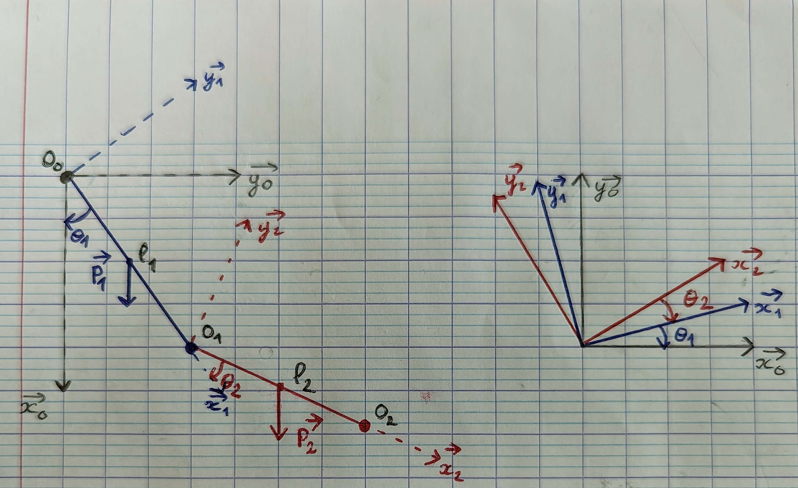
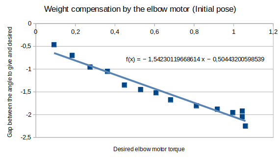
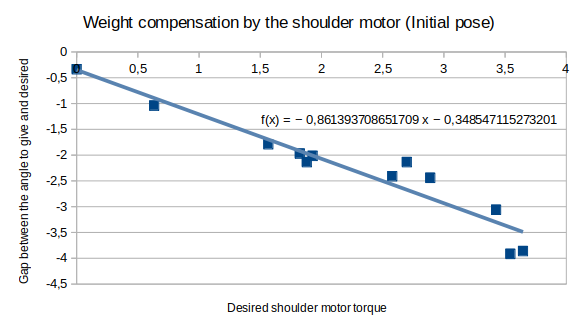

# Torque compensation

## Theoretical part

with $\theta_1$ and $\theta_2$ positive

Torque due to the weight on the elbow motor

$\tau_2=  \overrightarrow{O_1P_2} \wedge \overrightarrow{P_2}$

$\tau_2=  \frac{l_2}{2}. \overrightarrow{x_2} \wedge m_2 g.\overrightarrow{x_0}$

$\tau_2=  \frac{l_2}{2} m_2 g.\overrightarrow{z_0}$

Center of mass of the whole arm

$\overrightarrow{O_0P} =  \frac{1}{m_1 + m_2} (m_1. \overrightarrow{O_0P_1} + m_2.\overrightarrow{O_0P_2})$

$\overrightarrow{O_0P} =  \frac{1}{m_1 + m_2} (m_1 \frac{l_1}{2}. \overrightarrow{x_1} + m_2 (l_1 . \overrightarrow{x_1} + \frac{l_2}{2}.\overrightarrow{x_2}))$

$\overrightarrow{O_0P} =  \frac{1}{m_1 + m_2} (((m_1 \frac{l_1}{2} + m_2 l_1) \cos{(\theta_1)} + \frac{l_2}{2} m_2 \cos{(\theta_1 + \theta_2)}). \overrightarrow{x_0} - ((m_1 \frac{l_1}{2} +m_2 l_1)\sin{(\theta_1)} + \frac{l_2}{2} m_2 \sin{(\theta_1 + \theta_2)}).\overrightarrow{y_0})$

Torque due to the weight on the shoulder motor

$\tau_1 =  \overrightarrow{O_0P} \wedge \overrightarrow{P}$

$\tau_1 =  g((m_1 \frac{l_1}{2} + m_2 l_1) \sin{(\theta_1)} + \frac{l_2}{2} m_2 \sin{(\theta_1 + \theta_2)}). \overrightarrow{z_0}$ 

 

The torque to be given to the motor to compensate the weight is the opposite of the torque due to the weight.

## Practical application

It is not possible to control the reachy arm directly with the torques. The method is to give it a higher position than the desired one so that it reaches the desired value. So it is necessary to determine the relationship between the additional angle to be given in relation to the desired torque. The throw being only in one plane we decided to do it only for the elbow and the shoulder.

To determine this relationship, for each motor and for different angles and initial torques, the objective is to turn the motor by 10°. Increasingly large arm movements arm movements are made until the desired value is reached and the gap between desired angle and angle to give are collected.

This video illuste one acquisition of data for the elbow motor:

https://user-images.githubusercontent.com/74452893/217071843-9d4e4f5d-e662-413b-b864-dcdaed446088.mp4

### Elbow motor

To obtain the gap between desired angle and angle to give, *find_position_for_elbow_torque* need to be used.

This graph has been obtained:

$eps_{elbow} = -1.54423*\tau_{elbow}-0.504432$

### Shoulder motor

To obtain the gap between desired angle and angle to give, *find_position_for_shoulder_torque* need to be used.

This graph has been obtained:

$eps_{shoulder} = -0.86139*\tau_{shoulder} + 0.348547*sign(\theta_{shoulder})$

### Tests
To evaluate the results, for each motor, sequences of 10 small angle movements of 10° were made for different initial angles and therefore different torques to determine the the gap between desired angle and angle to give. The accuracy obtained even by adding weight at the end of the arm increased greatly with this correction and reached 1.5° at least.

To obtain the error of the compensation, *elbow_error_evaluate* and *shoulder_error_evaluate* need to be used with the compensated angle as a parameter.

One part of a test for shoulder motor is showed in this video:

https://user-images.githubusercontent.com/74452893/217072010-5d00ea56-0097-4767-8c16-d345bbe48841.mp4

**All data for pratical application are include in the [document](../images/torques.ods).**

## Usage

To correct angles to compensate the weight, the function *actif_angles_correction* in angles_correction.py need to be used. It takes in parameter desired shoulder angle, desired elbow angle and if the hand is empty or not. It return the shoulder and elbow angles that that must be given to compensate.  
