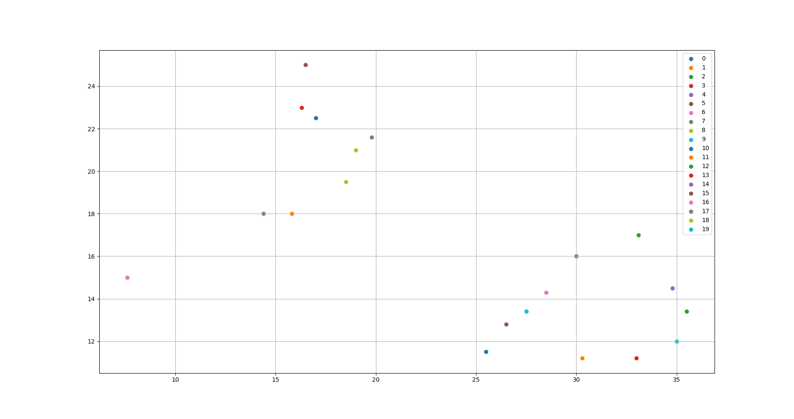
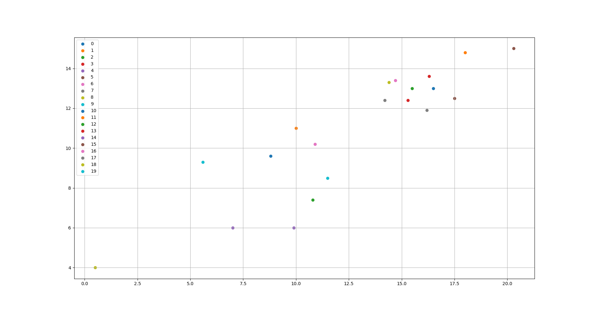
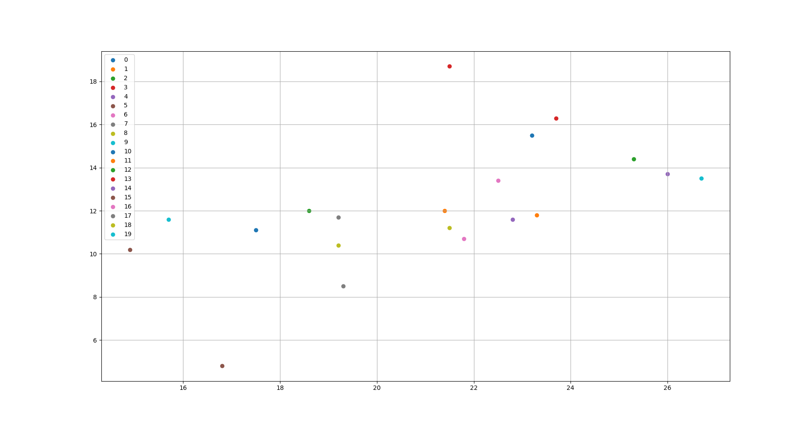
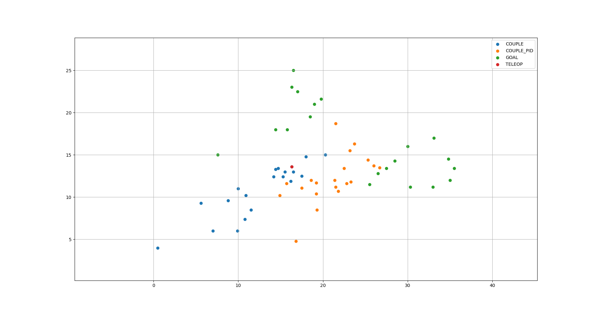
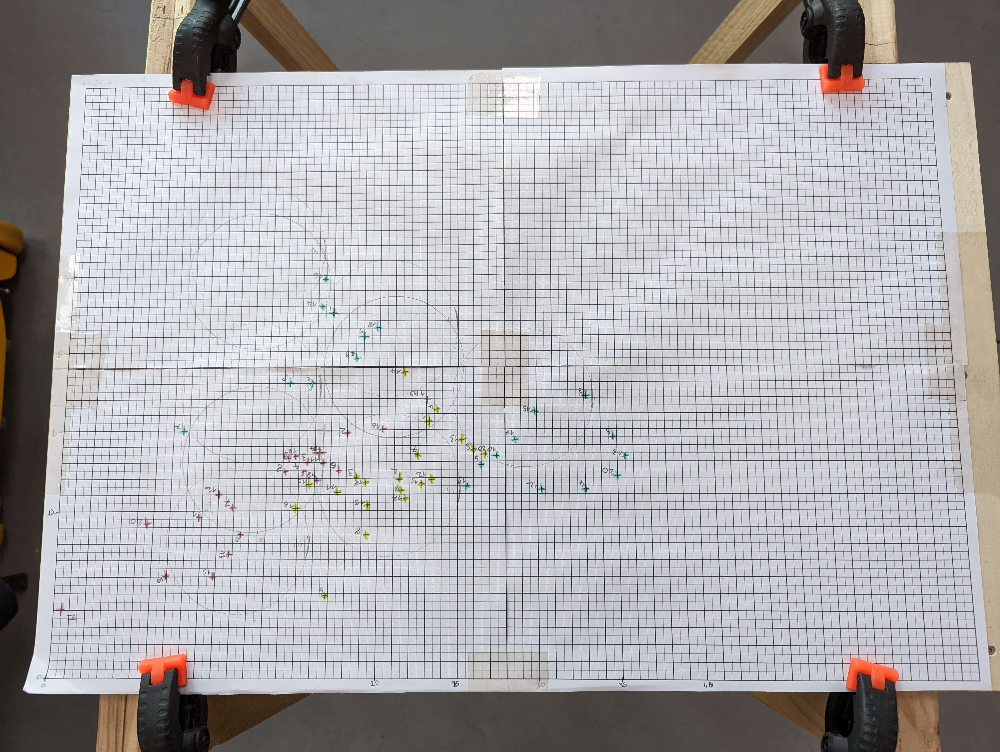

# Experiment on repeatability

With this experiment, we tried to quantify the non-repeatability of a Reachy's throw, by looking at the ball's fall point for a same trajectory given.

We made a comparison for different ways to reproduce a registered trajectory from teleoperation.

## Description of the experiment

We tried 3 ways of reproducing a trajectory.
- Using the goal position 
- Using the current position with torque compensation
- Using the current position with torque compensation and PID tuning

20 throws were reproduced for the same trajectory, and we obtained the ball's fall point and the temperature of each right arm motor.

finally we used a python script to compute the mean and variance and compare the position with different graphs.

## Results

The fall point coordinates during the teleoperation take was `[16.3 13.6]`.

In the graphs, reachy was on the left, throwing the ball to the right. The `[0 0]` point is the bottom left corner of the table.

### First method : with *Goal position*

We can observe two main fall areas, corresponding to the case if Reachy's hand retouch the ball (left points) or not (right points).

The resulting mean point is `[24.2  16.5]`, and the variance is `[65.8  17.8]` despite there are not really relevant due to the previous observation.

Therefore, we computed the mean and variance of the points that are not in the left area, and we obtain a mean of `[30.9 13.4]` and a variance of ` [11.8  3.4]`.

### Second method : with *Current position with torque compensation*

In this case, the area was a more expanded, illustrated with a variance of `[22.1  9.3]`.
The mean point, `[12.695 10.865]` is not as far as the teleoperation take.

### Third method : with *Current position with torque compensation and PID tuning*

This last experiment was better than the previous one, with a smaller variance of `[10.5  8.0]`.
Moreover, the mean point is `[21.0  12.1]`, which is closer to the teleoperation take.

## Analysis and Comparison

Finally, we can compare those three ways together in a complete graph.

Firstly, throws with the goal position are much far, but this is caused by a problem of getting the gripper position (see the [details of this problem](../developer/GoalPosition.md)), that result with a drift of the x-axis
the ball was released too early, but we can observe that the mean point y-axis is really near to the target from teleoperation.
Taking this into account, this method should be, as expected, the most accurate.

The second method is therefore the worst. Gravity torque compensation alone is not sufficient, and the ball meanly falls closer compared to the one of the teleoperation take.

Finally, we can see the third method as an melioration of the second one, with the aim to tend towards the perfect case that would be the first method with a good ball release point.
As we failed to find a solution to reduce the drift af the release point in the *goal position* method, this method is currently the most conclusive method.
