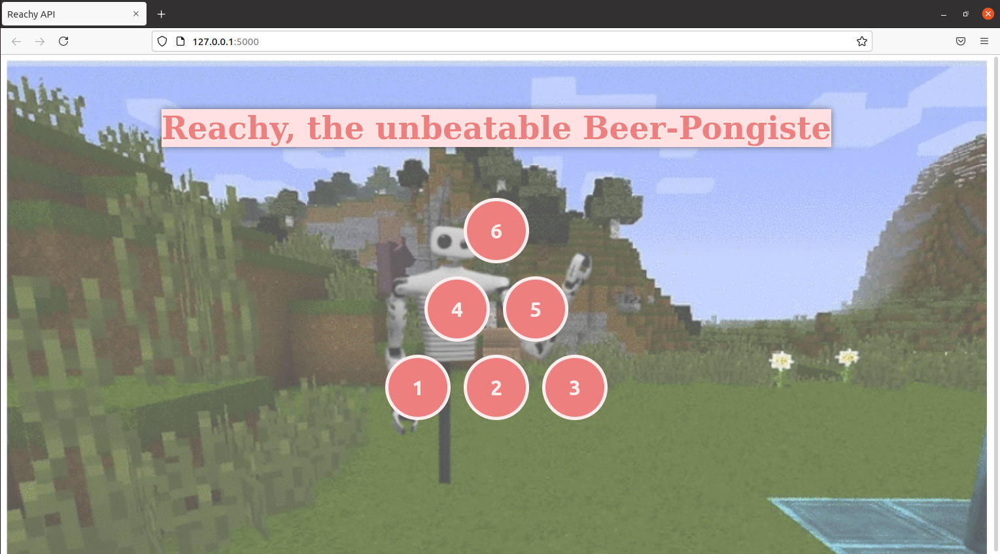

# 📖 User documentation
This section present our interface made for demonstration of dynamic movement and correction.
This demonstration is really only visual and about entertainment 

## 🖥 Launching services and the API
After having turn on Reachy, you can follow those few steps
* Open a shell and go to the root of the project 
```bash
cd /home/reachy/dynamic_reachy/src
```
* Launch all the services
```bash
launch_all
```
* In a new shell go to the root of the project 
```bash
cd /home/reachy/dynamic_reachy/src
```
* Launch the API
```bash
python3 api.py
```
* Open the given address in your browser

## 🤖 Playing with the API
The API is really simple to use, you can use the click on the different buttons, 
representing the different cups of the beer pong game.



## Security and emergency stop
To exit properly or urgently the API, you can use `Ctrl+C` in the shell where the API is running.
Reachy will execute its `turn_off_smoothly` routine.

Another way, in case of emergency, you can directly turn off the motors with both switch behind the back of Reachy.